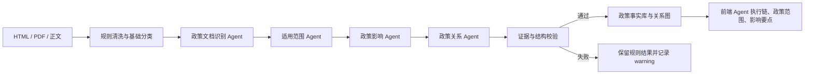

# FinEcho 政策 P0 Agent 实现方案

## 1. 目标与边界

本方案在现有政策事实库、政策脉络图和产业分析功能之上，新增四个 P0 Agent：政策文档识别、适用范围提取、政策影响分析、政策关系推理。它们负责把 HTML/PDF 清洗后的政策正文转换成可校验的结构化事实，而不是直接生成不可追溯的自由文本结论。

设计约束：

- 不替换现有规则，只在完整正文可用时调用大模型增强结果。
- 不改变已有政策查询、HTML 导入、图谱和产业分析接口。
- 所有范围、影响和关系都必须保留原文证据；证据无法在正文中复现时拒绝采用模型结果。
- 未配置模型、调用超时、结构校验失败时自动回退到规则，不中断导入。
- Agent 结论默认为机器候选；高风险效力、处罚、废止结论仍需人工复核。

## 2. 总体架构



Agent 按顺序执行，使后一个 Agent 可以使用前一个 Agent 已确认的结构。当前使用内存仓储，接口保持可替换性，后续可迁移到 PostgreSQL 与图数据库。

## 3. 四个 Agent

### 3.1 政策文档识别 Agent

输入为标题、来源与正文，输出对应 `PolicyDocument`：

- 判断是否为正式政策；
- 提取文号、发文机关、层级、文件类型；
- 判断生效、修订、废止、失效等效力状态；
- 识别红头文件特征；
- 拆分正文条款并生成结构化摘要。

规则层先提取文号和条款；模型只能补充或修正规则不确定字段。模型给出的文号和条款必须能在正文中复现。

### 3.2 适用范围 Agent

输出 `PolicyScope`，包括：

- 地区与行政层级；
- 行业和产业链节点；
- 适用主体；
- 项目阶段；
- 申请或准入条件、排除条件；
- 有效期；
- 原文证据和置信度。

范围结论的关键不是标签数量，而是“谁、在什么地区、满足什么条件、什么时间内、可做什么”。没有证据的模型范围不会覆盖规则结果。

### 3.3 政策影响 Agent

输出一个或多个 `PolicyImpact`，按以下方向归类：

- `support`：扶持、补贴、奖励、鼓励；
- `restrict`：限制、禁止、准入门槛；
- `mandatory`：必须、应当、不得等合规义务；
- `neutral`：申报、流程和一般规范。

每个影响项包含动作、目标主体、摘要、行业、产业链节点、证据、置信度和人工复核状态。处罚、限制和强制义务应优先进入人工复核队列。

### 3.4 政策关系 Agent

Agent 只允许在现有候选政策目录中选择目标节点，关系类型为：

- 依据 `based_on`；
- 实施 `implements`；
- 地方细化 `localizes`；
- 解读或引用 `interprets` / `cites`；
- 替代、废止 `supersedes` / `repeals`；
- 范围重叠、潜在冲突 `overlaps` / `conflicts_with`。

目标 ID 不存在或关系证据不在正文中时，模型关系被丢弃。规则层会优先识别正文中明确出现的文号或完整政策标题。

## 4. 可靠性机制

| 风险 | 防护措施 | 降级结果 |
|---|---|---|
| 未配置 API Key | 初始化时检测 | 全部使用规则，功能可用 |
| 模型超时或异常 | 单 Agent 超时与异常隔离 | 当前 Agent 回退，不影响后续步骤 |
| 输出格式漂移 | Pydantic 结构化输出 | 校验失败即回退 |
| 幻觉文号或条款 | 原文子串证据校验 | 拒绝覆盖规则字段 |
| 幻觉政策关系 | 候选 ID 白名单 + 原文证据 | 丢弃无效关系 |
| Agent 结果不可解释 | 保存 mode、confidence、evidence_count、warnings | 前端展示完整执行轨迹 |

## 5. 数据结构与接口

`PolicyDocument` 新增：

- `clauses: PolicyClause[]`：正文条款；
- `agent_runs: PolicyAgentRun[]`：四个 Agent 的执行轨迹。

新增接口：

```text
POST /api/v1/policy-imports/document
GET  /api/v1/policy-agents/status
```

正文导入示例：

```json
{
  "title": "某某政策通知",
  "content": "政策完整正文……",
  "source_name": "政府网站",
  "authority_name": "某某部门",
  "default_authority_level": "ministry",
  "persist": true
}
```

返回文档、发现的政策关系以及是否持久化。原有 `POST /policy-imports/html` 保持不变，并新增规则模式的 Agent 运行记录。

## 6. 前端呈现

政策详情增加“AI Agent 执行链”，依次展示四个 Agent 的：

- 执行方式：规则执行或模型增强；
- 状态：完成、回退、失败；
- 摘要、置信度与证据数量；
- 回退或校验警告。

现有适用范围、政策影响、政策图谱和产业分析入口不改变。用户可从执行链判断一个结论来自模型增强还是规则基线。

## 7. 配置、测试与上线

新增配置：

```text
POLICY_AGENTS_ENABLED=true
POLICY_AGENT_TIMEOUT_SECONDS=30
OPENAI_API_KEY=
OPENAI_MODEL=gpt-4.1-mini
```

建议分三阶段上线：

1. 影子模式：模型运行但只保存对比结果，统计规则/模型差异和证据通过率；
2. 候选模式：通过证据校验的结果进入待复核队列；
3. 辅助生产模式：低风险字段自动入库，高风险效力、处罚、冲突关系仍需人工确认。

核心监控指标包括 Agent 成功率、回退率、平均耗时、证据校验通过率、人工采纳率和字段级修正率。测试应覆盖无模型回退、模型异常、无效证据拒绝、有效结构合并、API 兼容性和前端构建。

## 8. 后续演进

- 增加 PDF/OCR 正文清洗器，并保存页码与坐标级证据；
- 将 Agent 结果做版本化，支持人工修订与审计回放；
- 引入政策时序判断，自动提示即将到期、被替代和潜在冲突；
- 将企业画像作为独立工具提供给影响 Agent，形成“政策条款 → 产业链 → 企业”的可验证链路；
- 用人工审核数据构建评测集，而不是直接把线上生成结果当作真值。
